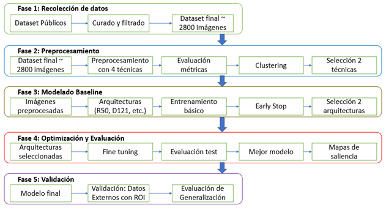
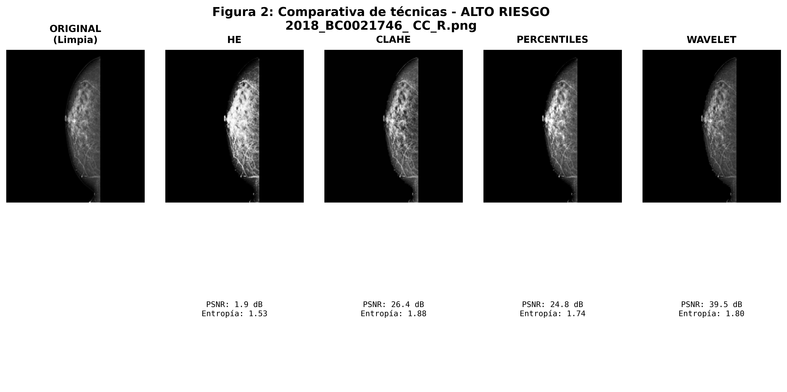
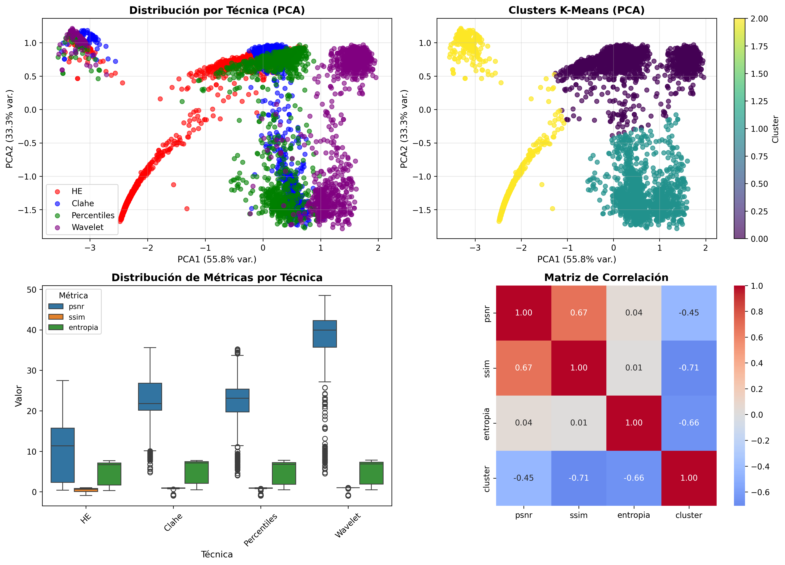

# Modelo basado en CNN para estimación binaria de riesgo de cáncer en mamografías digitales de mamas densas, utilizando BI-RADS como referencia. 


> Proyecto finalizado y documentado como parte de un trabajo de grado de maestría.

Este repositorio documenta el pipeline desarrollado en el trabajo de grado de maestría para la **estimación binaria de riesgo radiológico** en mamografías de mamas densas, utilizando redes neuronales convolucionales (CNN) y datasets públicos.

**Importante**:  
Este trabajo **no propone un sistema de diagnóstico clínico**, sino un modelo de **estimación de riesgo** alineado con criterios radiológicos (BI-RADS), con énfasis en la reducción de falsos negativos.

## Índice

- [Descripción general](#descripción-general)
- [Pipeline general del experimento](#pipeline-general-del-experimento)
- [Estructura del repositorio](#estructura-del-repositorio)
- [Ejemplos visuales del pipeline](#ejemplos-visuales-del-pipeline)
- [Configuración experimental](#configuración-experimental)
- [Reproducibilidad y consideraciones éticas](#reproducibilidad-y-consideraciones-éticas)
- [Requisitos](#requisitos)
- [Referencia](#referencia)
- [Licencia](#licencia)

## Descripción general

El pipeline integra múltiples datasets públicos de mamografía, ejecutando un proceso completo que incluye:

- exploración y curaduría de metadatos,
- conversión de imágenes DICOM a PNG y normalización,
- evaluación sistemática de técnicas de preprocesamiento,
- transferencia de aprendizaje y ajuste fino de modelos CNN,
- y análisis cualitativo de interpretabilidad mediante mapas de saliencia.

El proceso se ejecuta **por etapas**, en distintos entornos computacionales (local y cloud), considerando restricciones reales de tamaño de datos, recursos y ética.


## Pipeline general del experimento



**Etapas principales:**

1. Descarga de datasets públicos en formato DICOM  
2. Análisis exploratorio de metadatos y consolidación del dataset maestro  
3. Conversión DICOM → PNG, normalización de polaridad y eliminación de artefactos (entorno local)  
4. Almacenamiento intermedio de imágenes PNG en Google Drive  
5. Aplicación y evaluación de técnicas de preprocesamiento (Colab)  
6. Transfer learning sin ajuste fino  
7. Ajuste fino de modelos seleccionados  
8. Análisis de interpretabilidad mediante mapas de saliencia  

## Estructura del repositorio


```text
|---Analisis_exploratorio_inicial
|   |---EDA.py
|   |---dataset_maestro_metadata.csv
|---Encuesta
|   |---Encuesta_Priorización clínica en sistemas de IA para detección de cáncer de mama (Respuestas).xlsx
|   |---Figura_4_0_Distribucion_profesiones.png
|   |---Indicaciones.md
|---Fine_Tuning
|   |---Densenet121_percentiles
|   |   |---FT_Densenet.py
|   |   |---Kfolds_densenet.py
|   |   |---analisis_sobreajuste_densenet.py
|   |---Inception_Wavelet
|       |---FT_inception.py
|       |---Kfolds_inception.py
|       |---analisis_sobreajuste_inception.py
|---Interpretabilidad
|   |---Saliencia_Densenet121.py
|---L-transfer
|   |---Percentiles
|   |   |---percentiles_baseline.py
|   |   |---resultado_Densenet121_BASELINE.json
|   |---wavelet
|       |---baseline_wavelet.py
|---Preprocesamiento
|   |---Ejemplo_preprocesamiento
|   |   |---Figura_Comparativa_02.png
|   |   |---Figura_Comparativa_03.png
|   |---Resultado_kmeans
|   |   |---Analisis_Clustering_Completo.png
|   |   |---Distribucion_Clusters.png
|   |   |---Metodo_Codo_KMeans.png
|   |---Preprocesamiento_mamografias.py
|   |---analisis_clustering_kmeans.py
|---Conversion-normalizacion
|   |---CBIS
|   |   |---calc_case_description_test_set.csv
|   |   |---calc_case_description_train_set.csv
|   |   |---mass_case_description_test_set.csv
|   |   |---mass_case_description_train_set.csv
|   |   |---conversion_bajo_riesgo_cbis.py
|   |   |---conversion_alto_riesgo_cbis.py
|   |---DrMammo
|   |   |---breast-level_annotations.csv
|   |   |---conversion_dicom_png_polaridad.csv
|   |   |---exploracion_metadatos_vindr_mammo.py
|   |   |---finding_annotations.csv
|   |   |---mapeo_metadatos_vindt_mammo.py
|   |---INbreast
|       |---INbreast.csv
|       |---procesamiento_inbreast_alto_riesgo.py
|       |---procesamiento_inbreast_bajo_riesgo.py
|---.gitignore
|---LICENSE
|---README.md
|---Requerimientos.md
|---Template.yaml
```

### Descripción por carpetas

- **Analisis_exploratorio_inicial/**  
  Scripts para exploración inicial de metadatos (`EDA.py`) y generación del archivo maestro `dataset_maestro_metadata.csv`.

- **Conversion-normalizacion/**  
  Conversión de imágenes DICOM a PNG, normalización de polaridad y eliminación de artefactos.  
  Esta etapa se ejecuta en entorno local debido al tamaño de los datasets originales y a limitaciones computacionales.

- **Preprocesamiento/**  
  Aplicación de técnicas de preprocesamiento (wavelet, percentiles, HE, CLAHE) y evaluación mediante análisis de clustering (K-means).

- **L-transfer/**  
  Evaluación de modelos base sin ajuste fino para analizar el impacto del preprocesamiento y seleccionar arquitecturas prometedoras.

- **Fine_Tuning/**  
  Ajuste fino de modelos seleccionados (DenseNet121 e Inception), con validación cruzada, control de sobreajuste y manejo de desbalance de clases.

- **Interpretabilidad/**  
  Análisis cualitativo mediante mapas de saliencia, aplicado a un subconjunto de casos (TP, TN, FP, FN).

- **Encuesta/**  
  Resultados de una encuesta exploratoria sobre priorización clínica de métricas en sistemas de IA para detección de cáncer de mama.


## Ejemplos visuales del pipeline

### Comparación de técnicas de preprocesamiento


### Análisis de clustering para evaluación de preprocesamiento


*(Las imágenes se incluyen únicamente con fines ilustrativos del pipeline y no corresponden a datos clínicos identificables.)*


## Configuración experimental

El archivo **`Template.yaml`** define las decisiones experimentales de la etapa reproducible del pipeline, incluyendo:

- técnica de preprocesamiento,
- arquitectura del modelo,
- estrategia de validación,
- criterios de entrenamiento.

Este archivo separa la **configuración experimental** del código fuente y permite la replicación del flujo de entrenamiento sin exponer datos sensibles.

## Reproducibilidad y consideraciones éticas

Este repositorio **no redistribuye imágenes médicas ni modelos entrenados**, aunque los datasets utilizados sean públicos.  
Esto se hace por razones éticas y legales, ya que:

- los datos clínicos no pertenecen al autor,
- los modelos entrenados pueden memorizar información sensible,
- y la redistribución directa no es necesaria para garantizar reproducibilidad.

La reproducibilidad se garantiza mediante:
- la documentación explícita del pipeline,
- scripts completos por etapa,
- y archivos de configuración template que permiten reconstruir el experimento bajo las licencias originales de cada dataset.


## Requisitos

Los requisitos generales del entorno de ejecución se describen en el archivo `Requerimientos.md`.

Las etapas de conversión DICOM → PNG se ejecutan en entorno local (CPU), mientras que las etapas de entrenamiento y evaluación se ejecutan en Google Colab utilizando aceleradores (TPU/GPU según disponibilidad).


## Referencia

Este repositorio acompaña al trabajo de grado de maestría:

**Modelo basado en CNN para estimación binaria de riesgo de cáncer en mamografías digitales de mamas densas, utilizando BI-RADS como referencia**  
Autor: *Jhon Jaime Vaca Hincapié*  
Año: *2026*

## Licencia
El código de este repositorio se distribuye bajo la licencia MIT.  
Los datasets utilizados están sujetos a sus propias licencias y términos de uso.
Uso académico y educativo.  
Cualquier reutilización debe citar el trabajo original de maestría.

